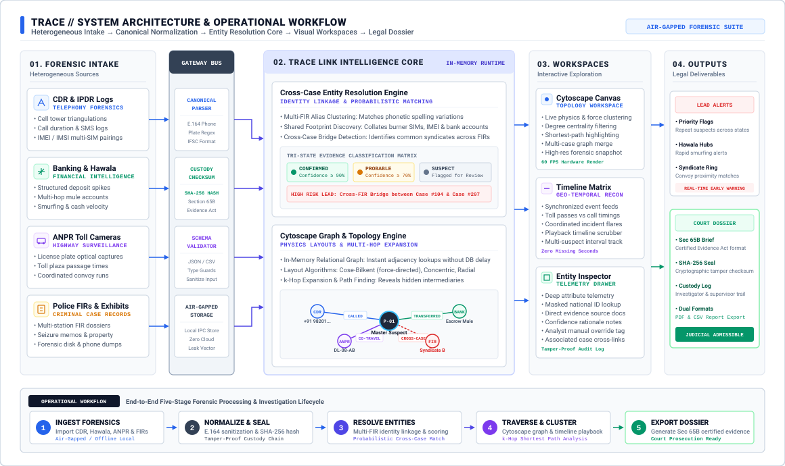
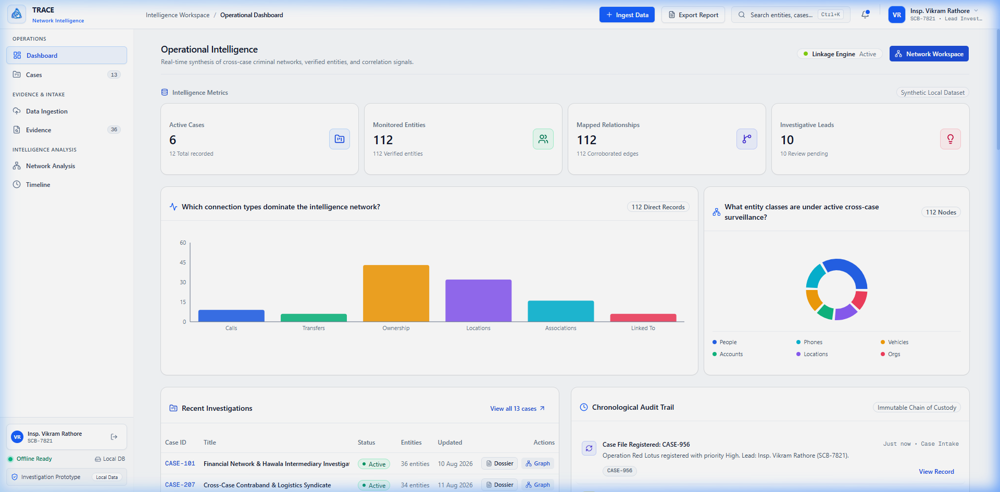
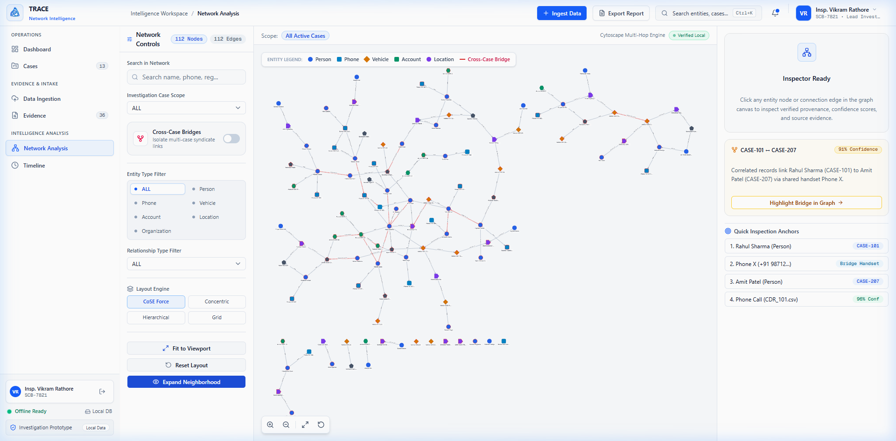
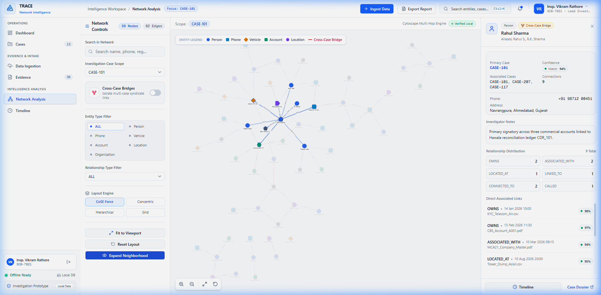
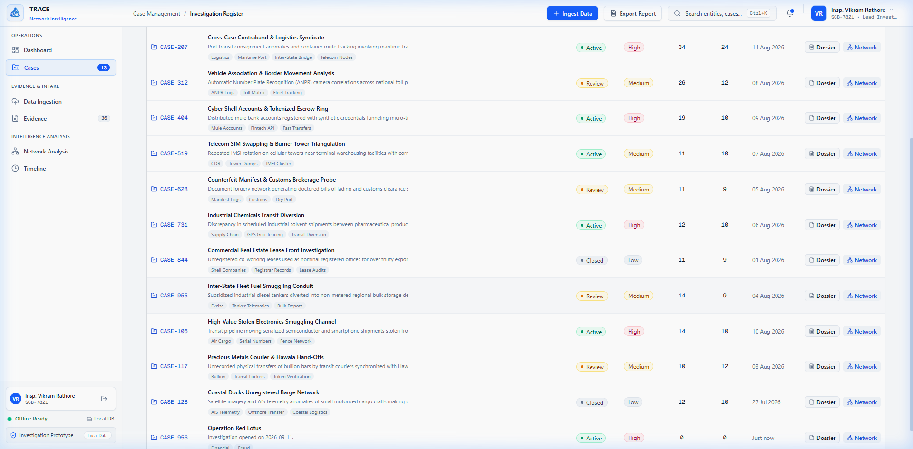
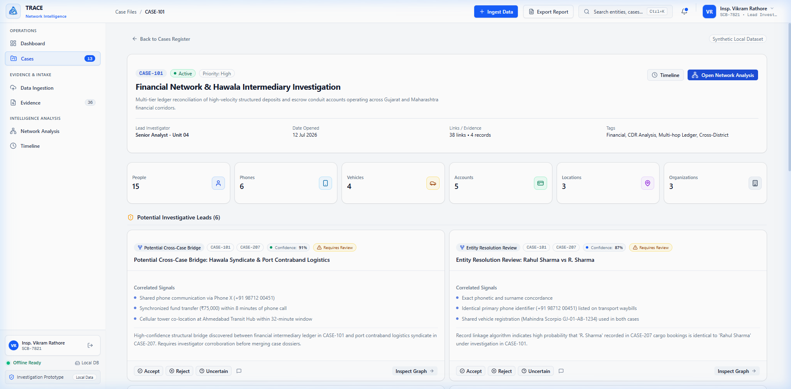
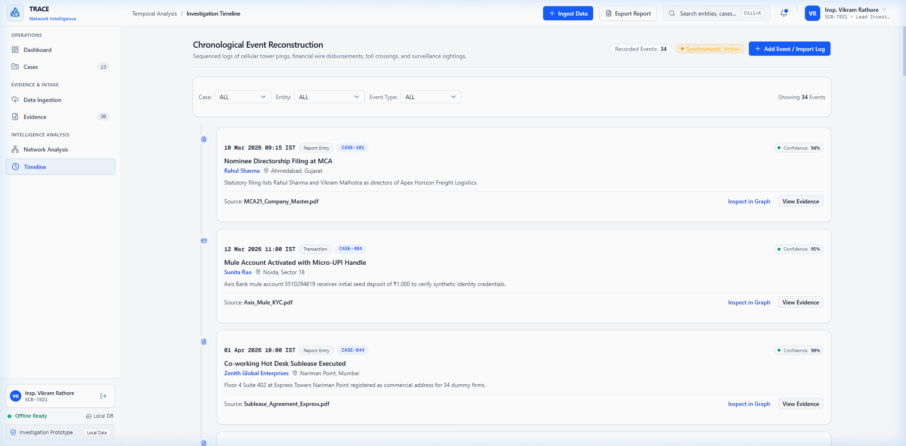
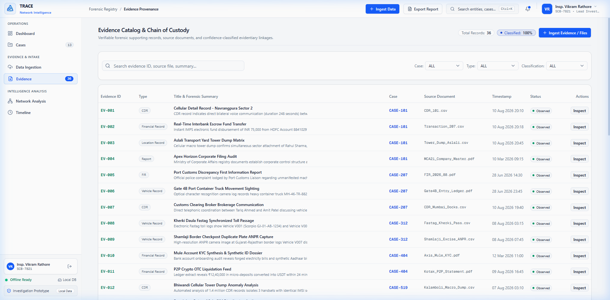
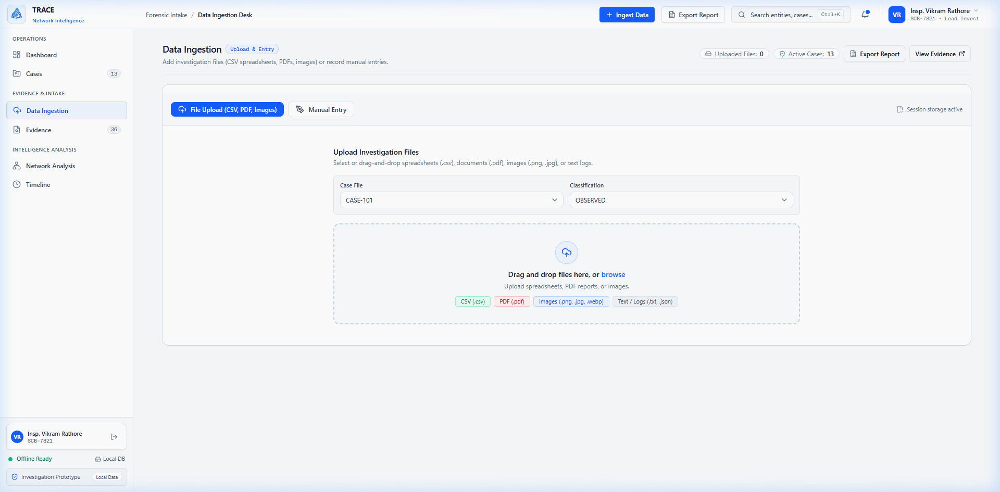

# TRACE — Tactical Resolution &amp; Analysis of Criminal Entities

<div align="center">


## Criminal Network Analysis &amp; Link Intelligence Platform

**Cross-case entity resolution, multi-hop link discovery, and Section 65B court-admissible evidence generation.**  
*An air-gapped, offline-first forensic intelligence suite developed by Team **`weContribute`** for the **Smart India Hackathon (SIH)***

[](https://nextjs.org/)
[](https://react.dev/)
[](https://www.typescriptlang.org/)
[](https://www.electronjs.org/)
[](https://js.cytoscape.org/)
[](https://tailwindcss.com/)
[](#security--compliance)

[**System Architecture &amp; Workflow**](#system-architecture--operational-workflow) &nbsp;•&nbsp;
[**Visual Tour &amp; Screenshots**](#visual-walkthrough--screenshot-gallery) &nbsp;•&nbsp;
[**Workspaces**](#workspaces--core-modules) &nbsp;•&nbsp;
[**Quick Start**](#quick-start--installation) &nbsp;•&nbsp;
[**Demo Credentials**](#demo-credentials)

</div>

---

### Core Operational Capabilities at a Glance

| Supported Evidence Ingestion | Automated Cross-Case Detection | Investigator Analysis Tools | Legal &amp; Prosecution Outputs |
| :--- | :--- | :--- | :--- |
| • **Telecom**: CDR &amp; IPDR call/SMS logs<br>• **Financial**: Bank wires &amp; Hawala ledgers<br>• **Surveillance**: ANPR highway toll passes<br>• **Case Records**: State Police FIR dossiers | • **Shared Footprint**: Matches phones &amp; IMEIs across FIRs<br>• **Hawala Hubs**: Flags smurfing &amp; cash velocity spikes<br>• **Convoy Tracking**: Correlates co-traveling vehicles<br>• **Alias Linking**: Clusters phonetic suspect names | • **Cytoscape Canvas**: Interactive network graph<br>• **k-Hop Traversal**: Expands hidden conduits<br>• **Chrono Matrix**: Synchronized incident timeline<br>• **Entity Inspector**: Provenance &amp; attribute drawer | • **Court Dossier**: Exportable PDF &amp; CSV briefs<br>• **Section 65B**: Indian Evidence Act certificate<br>• **Tamper Seal**: SHA-256 cryptographic hash<br>• **Audit Trail**: Supervisor sign-off &amp; custody log |

---

## Executive Summary & Mission

Law enforcement agencies and intelligence divisions frequently operate across fragmented evidentiary records: Call Detail Records (CDR), Hawala ledger reconciliations, Automatic Number Plate Recognition (ANPR) camera logs, bank transactions, and field surveillance dossiers. When data sits in disparate silos, cross-jurisdictional criminal syndicates exploit investigative blind spots.

**TRACE** (Tactical Resolution & Analysis of Criminal Entities) is a unified intelligence analysis and link discovery platform designed to convert unstructured, multi-source forensic records into actionable network intelligence. TRACE equips investigators to:

- **Resolve Entities & Aliases**: Automatically cluster phone numbers, bank accounts, vehicle registrations, and aliases across disconnected case files.
- **Surface Cross-Case Syndicates**: Reveal hidden multi-hop linkages and financial conduit intermediaries that span across independent FIRs and police stations.
- **Visualize Dynamic Criminal Topologies**: Provide high-performance, physics-directed graph exploration powered by **Cytoscape.js**.
- **Reconstruct Chronological Timelines**: Correlate cell tower pings, wire disbursements, surveillance sightings, and toll passes along a unified temporal axis.
- **Maintain Chain of Custody**: Catalog forensic evidence with strict classification levels, tamper-evident source tracking, and confidence scoring.
- **Operate Anywhere**: Run both as a centralized secure web application and as an air-gapped, offline-ready **Electron desktop application**.

---

## System Architecture & Operational Workflow

TRACE combines heterogeneous forensic ingestion, automated canonical normalization, an in-memory cross-case entity resolution engine, and interactive visual analyst workspaces into an end-to-end investigative pipeline.



### Architectural Layers & Subsystems

1. **Forensic Ingress Subsystem**: Ingests disparate, unstructured forensic evidence:
   - **Telephony & CDR Logs**: Cell tower triangulations, azimuth angles, IMEI/IMSI pairings, and call duration logs.
   - **Financial & Hawala Ledgers**: High-velocity structured deposits, mule account networks, and smurfing threshold evasion.
   - **ANPR Surveillance**: Highway toll plaza optical captures, passage timestamps, and coordinated convoy detection.
   - **Police FIRs & Exhibits**: Multi-jurisdictional case files, seizure memos, property logs, and digital media extractions.
2. **Canonical Normalization Bus**: Sanitizes raw records through strict E.164 phone canonicalization, license plate/IFSC regex validators, and generates SHA-256 cryptographic hashes for statutory Section 65B Indian Evidence Act custody logging.
3. **TRACE Link Intelligence Core (In-Memory)**:
   - **Cross-Case Entity Resolution Engine**: Executes phonetic alias clustering (Soundex/Levenshtein) and shared device footprint matching across independent police FIRs, classifying leads into *Confirmed (≥90%)*, *Probable (≥70%)*, or *Suspect* review states.
   - **Cytoscape Graph & Topology Engine**: In-memory adjacency matrix managing physics force-directed layouts (`cose-bilkent`, concentric), multi-hop $k$-neighborhood expansion, shortest-path calculation, and syndicate bridge detection.
4. **Analyst Workspaces**: 60 FPS hardware-rendered Cytoscape graph canvas, geo-temporal chronological incident playback matrix, and deep entity/evidence inspector drawers.
5. **Operational Deliverables**: Real-time syndicate alerts and cryptographically sealed, court-admissible Section 65B PDF/CSV dossiers.

---

## Visual Walkthrough & Screenshot Gallery

### 01. Role-Based Authentication & Investigator Switcher

Secure gateway supporting role-differentiated access for Lead Investigators, Cyber Forensic Analysts, and Supervisory Officers. Includes one-click demo credentials for rapid hackathon evaluation and air-gapped testing.


**Key Capabilities:**

- Role-based authorization tailored to departmental clearance (Crime Branch, Cyber Crime Unit, Zonal Division).
- Fast-switch investigator profiles with audit trail logging.
- Badge ID credential verification with sample data autofill.

---

### 02. Operational Intelligence & Executive Dashboard

The operational epicenter providing macroscopic visibility over active syndicates, cross-case linkages, high-priority investigative leads, and system-wide activity feeds.



**Key Capabilities:**

- **Top-Level Metrics**: Live indicators tracking Active Cases, Resolved Entities, Cross-Case Correlations, and Verified Evidence.
- **Network Linkage Analytics**: Visual charts breaking down connection densities and entity type distributions.
- **Investigative Leads Engine**: AI-assisted heuristics flagging multi-hop conduits, unregistered mobile nodes, and rapid transaction bursts.
- **Audit Activity Stream**: Timestamped logging of data modifications and case status changes.

---

### 03. Interactive Criminal Network Graph Workspace

A full-canvas graph exploration environment powered by **Cytoscape.js**, enabling investigators to traverse complex criminal topologies, untangle hawala chains, and expose syndicate hubs.



**Key Capabilities:**

- **Dynamic Layout Algorithms**: Real-time switching between CoSE (Compound Spring Embedder physics), Breadthfirst, Concentric, Circle, and Grid layouts.
- **Entity Type Filtering**: Toggle visibility of Persons, Phones, Vehicles, Bank Accounts, Locations, and Organizations.
- **Cross-Case Linkage Isolation**: One-click filter isolating only nodes and edges connecting multiple independent cases.
- **Relational Edge Analysis**: Inspect directional calls, financial remittances, vehicle associations, and familial/accomplice ties.

---

### 04. Deep Entity & Relationship Inspection Drawer

Contextual side panel that slides out upon selecting any entity node or connecting edge, offering granular intelligence without losing graph navigation context.



**Key Capabilities:**

- **Suspect Profile & Identifiers**: Full names, aliases, National IDs/Aadhaar references, phone numbers, and threat levels.
- **Association Matrix**: Direct list of all first-degree and secondary connections with confidence ratings.
- **Cross-Case Occurrences**: Highlights every case dossier where the entity appears.
- **Edge Telemetry**: Displays transaction values (INR), call frequencies, duration sums, and supporting evidence references.

---

### 05. Case Files & Multi-Jurisdictional Dossier Register

Central repository of all open, review, and closed investigations. Enables filtering by jurisdiction, priority, status, and forensic tags.



**Key Capabilities:**

- **Multi-Facet Search & Filtering**: Filter by Active/Review/Closed status, priority (Critical, High, Medium), or tags (Hawala, ANPR, CDR, Maritime).
- **Investigator Assignment**: Clear visibility of lead investigators and departmental desks.
- **Entity & Evidence Counters**: At-a-glance tallies of associated suspects and linked forensic files.
- **Quick Dossier Creator**: Fast modal to initiate new investigations with structured metadata.

---

### 06. In-Depth Case Dossier View

A comprehensive investigation dossier (e.g. *CASE-101: Financial Network & Hawala Intermediary Investigation*) aggregating all resolved entities, relational edges, and case-specific leads.



**Key Capabilities:**

- **Categorized Entity Register**: Tabulated lists for Persons, Phone Numbers, Vehicles, Bank Accounts, and Locations.
- **Case-Specific Network Focus**: Jump straight into the Network Graph filtered specifically to the case's subgraph.
- **Direct Linkage Indicators**: Badges displaying entity confidence scores and operational roles.
- **Case Narrative**: Detailed operational briefs and ongoing hypotheses recorded by the lead investigator.

---

### 07. Chronological Event Reconstruction & Timeline

A temporal event reconstruction workspace synchronizing diverse timestamped records into a coherent chronological narrative of criminal activity.



**Key Capabilities:**

- **Cross-Source Event Sequencing**: Merges phone calls, wire transfers, border toll crossings, and surveillance sightings into one timeline.
- **Event Categorization**: Color-coded markers for Cellular Pings, Financial Transactions, Travel/Tolls, and Physical Sightings.
- **Entity Deep-Linking**: Click on any participant to open their full dossier or center them in the graph.
- **Direct Log Import**: Add new timeline events or import time-series logs directly into active investigations.

---

### 08. Forensic Evidence Catalog & Chain of Custody

Tamper-evident catalog tracking physical and digital evidence records, forensic reports, CDR extracts, and bank statements with strict chain of custody verification.



**Key Capabilities:**

- **Classification Levels**: Rigorous labeling across *Top Secret*, *Restricted*, *Confidential*, and *Unclassified*.
- **Evidentiary Confidence Weights**: Percentage-based confidence rankings (Confirmed 95%+, Probable 75%+, Suspected 50%+, Inconclusive).
- **Chain of Custody Custodians**: Complete logging of seizing officers, custody transfers, and forensic examiners.
- **Source Document Metadata**: Storage paths, file formats (CSV, PDF, PCAP, JPG, XLSX), and ingest timestamps.

---

### 09. Unified Data Ingest Pipeline & Intelligence Reporting

Multi-format data intake suite combining bulk file ingestion with structured manual record entry, accompanied by one-click executive report generation.



**Key Capabilities:**

- **Dual Ingest Modes**: Drag-and-drop file upload for CDR/bank spreadsheets alongside structured manual entity entry forms.
- **Intelligent Entity Parsing**: Extracts phone numbers, IMEI numbers, vehicle plates, and account numbers into normalized records.
- **Custom Evidence Management**: Review, edit notes, or delete ingested forensic records in real time.
- **Export Intelligence Dossiers**: Built-in reporting modal generating standardized executive intelligence briefings for supervisory review and court presentation.

---

## Workspaces & Core Modules

| Module | Route | Primary Technology | Description |
| :--- | :--- | :--- | :--- |
| **Authentication** | `/login` | React 19 State, Local Storage | Investigator profile switcher and badge authentication. |
| **Operational Intelligence** | `/dashboard` | Recharts, Tailwind CSS v4 | System metrics, linkage distributions, and active leads. |
| **Case Register** | `/cases` | Client-side reactive store | Filterable register of all investigation dossiers. |
| **Case Dossier** | `/cases/[id]` | Dynamic App Router (`[id]`) | Detailed case dossier with entity breakdown and evidence links. |
| **Network Workspace** | `/network` | Cytoscape.js, Canvas Engine | Physics-based interactive criminal network visualization. |
| **Timeline Reconstruction** | `/timeline` | Temporal Sorting, Lucide | Unified chronological sequencing of multi-source events. |
| **Evidence Catalog** | `/evidence` | Chain of Custody Model | Classified evidentiary repository with confidence metrics. |
| **Data Ingestion** | `/ingest` | File Parser & Form Scaffolding | Bulk ingestion and manual entity registration pipeline. |

---

## Technical Stack

### Frontend & Architecture

- **Framework**: [Next.js 16.3](https://nextjs.org/) (App Router, Server & Client Components)
- **Runtime**: [React 19.2](https://react.dev/)
- **Language**: [TypeScript 5](https://www.typescriptlang.org/)
- **Styling**: [Tailwind CSS v4](https://tailwindcss.com/) with CSS-first variable architecture
- **Design Primitives**: Base UI (`@base-ui/react`), Lucide React icons, Class Variance Authority (`cva`)
- **Animation**: `tw-animate-css` and `motion`

### Graph & Analytics Visualization

- **Graph Engine**: [Cytoscape.js 3.34](https://js.cytoscape.org/) (Custom canvas rendering, CoSE physics engine, Breadthfirst, Concentric layouts)
- **Analytics Charts**: [Recharts 3.10](https://recharts.org/) (Responsive SVG and bar/pie metrics)

### Desktop Native Application

- **Framework**: [Electron 44](https://www.electronjs.org/)
- **Builder**: `electron-builder 26`
- **Concurrency**: `concurrently` and `wait-on` for dual-process dev servers
- **Target OS**: Windows, macOS, Linux (packaged as native binaries)

---

## Quick Start & Installation

### Prerequisites

- **Node.js**: Version `18.x` or higher (`v24.x` recommended)
- **npm**: Version `9.x` or higher

### 1. Clone the Repository

```bash
git clone https://github.com/JainamKhara/trace.git
cd trace
```

### 2. Install Dependencies

```bash
npm install
```

### 3. Run the Web Application

Launch the Next.js development server:

```bash
npm run dev
```

Open your browser and navigate to:

```
http://localhost:3000
```

*(The system automatically redirects to `/login`)*

### 4. Run as Desktop Application (Electron)

Launch both the Next.js development server and the native Electron window concurrently:

```bash
npm run electron:dev
```

### 5. Build for Production

To build the Next.js production web bundle:

```bash
npm run build
npm run start
```

To package the standalone Electron desktop executable for your operating system:

```bash
npm run electron:build
```

---

## Demo Credentials

For testing and demonstration, TRACE includes built-in investigator profiles accessible from the login screen:

| Investigator | Badge ID | Role | Department | Default Password |
| :--- | :--- | :--- | :--- | :--- |
| **Insp. Vikram Rathore** | `SCB-7821` | Lead Investigator | Crime Branch HQ, Unit 1 | `password123` |
| **Dr. Ananya Sharma** | `CYB-4092` | Forensic Analyst | Cyber Crime Unit | `password123` |
| **ACP Rajesh Menon** | `IPS-1104` | Supervisory Officer | Central Zone Office | `password123` |

> *Tip: Click on any profile under "Test Accounts" on the login screen to sign in instantly, or click "Use sample credentials" on the Manual Sign In tab.*

---

## Project Structure

```text
trace/
├── app/                              # Next.js App Router routes
│   ├── cases/                        # Case Dossiers register & [id] detail views
│   │   ├── [id]/page.tsx             # In-depth case file view
│   │   └── page.tsx                  # Case files index
│   ├── dashboard/                    # Operational Intelligence dashboard
│   ├── evidence/                     # Evidence catalog & chain of custody
│   ├── ingest/                       # File upload & manual entity data intake
│   ├── login/                        # Authentication & investigator switcher
│   ├── network/                      # Cytoscape graph network workspace
│   ├── timeline/                     # Chronological event reconstruction
│   ├── globals.css                   # Tailwind CSS v4 variables & themes
│   ├── layout.tsx                    # Root layout with metadata & AppShell
│   └── page.tsx                      # Root route redirect
├── components/                       # Modular UI & Feature Components
│   ├── cases/                        # CaseTable, NewCaseModal
│   ├── common/                       # ConfidenceBadge, ClassificationBadge, ProductLogo
│   ├── dashboard/                    # StatOverview, NetworkOverviewChart, LeadList
│   ├── evidence/                     # EvidenceTable
│   ├── ingest/                       # FileUploadZone, ManualEntryForm, DataIngestModal
│   ├── layout/                       # AppShell, Header, Sidebar
│   ├── network/                      # NetworkWorkspace, NetworkGraph, EntityPanel
│   ├── reports/                      # ExportReportModal
│   ├── timeline/                     # InvestigationTimeline
│   └── ui/                           # Base UI component primitives (Button, Card, Input)
├── data/                             # Realistic intelligence seed datasets
│   ├── accounts.json                 # Bank accounts and conduits
│   ├── cases.json                    # Active and historical case dossiers
│   ├── evidence.json                 # Forensic exhibits and digital evidence
│   ├── leads.json                    # Heuristic correlation leads
│   ├── locations.json                # Geocoded surveillance locations
│   ├── persons.json                  # Suspects, handlers, and intermediaries
│   ├── relationships.json            # Relational edges (calls, transactions, ties)
│   ├── timeline.json                 # Timestamped event log
│   └── vehicles.json                 # Registered vehicles & ANPR records
├── electron/                         # Native desktop shell
│   └── main.cjs                      # Electron window management & lifecycle
├── lib/                              # Core services and business logic
│   ├── authContext.tsx               # Investigator session state & demo auth
│   ├── dataService.ts                # Intelligence querying, filtering, and storage
│   └── utils.ts                      # Utility functions & class merges
├── public/                           # Static assets
│   └── screenshots/                  # High-resolution application screenshots
├── screenshots/                      # Root repository screenshots folder
├── types/                            # TypeScript type contracts
│   ├── auth.ts                       # Investigator user interfaces
│   └── investigation.ts              # Entity, Case, Relationship, Evidence types
├── package.json                      # Project dependencies & build scripts
├── tsconfig.json                     # TypeScript compiler configuration
└── README.md                         # Project documentation
```

---

## Security & Compliance

- **Air-Gapped Operation**: TRACE has zero hard external runtime dependencies and can be deployed in closed, air-gapped forensic laboratories.
- **Chain of Custody**: Every evidence item preserves original source provenance, ingest timestamps, and custodian IDs.
- **Role Isolation**: Sensitive actions (exporting intelligence dossiers, changing case status) are restricted according to officer classification.
- **Data Privacy**: Built-in mock data adheres to standard demonstration formats with no real-world Personally Identifiable Information (PII).

---

## Contributing & Team

Developed for the **Smart India Hackathon (SIH)** by **Team `weContribute`**:

- **Lead Architecture & UI/UX Design**: Jainam Khara
- **Network Link Analysis & Cytoscape Pipeline**: Team `weContribute`
- **Forensic Data Modeling & Ingestion Engine**: Team `weContribute`

---

© 2026 TRACE Intelligence System • Team weContribute
